# 🍽️ FoodIzo

**FoodIzo** is a robust and responsive **MERN Stack**-powered food ordering platform, designed for scalability and performance. It features **secure authentication**, **Stripe payments**, **email verification**, **image uploads to Cloudinary**, and comprehensive **user/admin panels** — all in one seamless experience.

> 🗓️ Built: Jan 2025  
> 🛠️ Tools: React, Node.js, Express.js, MongoDB, Stripe, JWT, Bcrypt, Nodemailer, Multer, Cloudinary

---

## 🌐 Live Demo

👉 [Visit FoodIzo](#) *(https://foodizo-frontend.onrender.com/)*   
👉 [Foodizo-Admin](#) *(https://foodizo-admin.onrender.com/)*

---

## 🔥 Core Features

- 🍱 **7+ Food Categories** with intuitive **filtering**
- 🧑‍💻 **User & Admin Dashboards** with **role-based access**
- 🔐 **JWT Authentication** & **Password Hashing (Bcrypt)**
- 📧 **Email Verification & Password Reset** using **Nodemailer**
- 🛍️ **Cart**, **Checkout**, **Order History**, and **Order Tracking**
- 💳 **Stripe Payment Integration** (98% success rate)
- 🖼️ **Image Uploads via Multer** stored securely on **Cloudinary**
- 📱 **Responsive Design** for all screen sizes
- 🔄 **RESTful & Authenticated APIs** for frontend-backend sync

---

## 🧰 Tech Stack

| **Frontend**       | **Backend**       | **Database** | **Authentication**     | **Media Storage**         | **Payments** |
|--------------------|-------------------|--------------|-------------------------|----------------------------|--------------|
| React              | Node.js           | MongoDB      | JWT                     | Multer                     | Stripe       |
| Bootstrap, CSS     | Express.js        | Mongoose     | Bcrypt (Password Hash)  | Cloudinary (Image Uploads) |              |
| Axios              |                   |              | Nodemailer (Email Auth) |                            |              |

---

## 📸 Screenshots

### 🏠 Homepage  
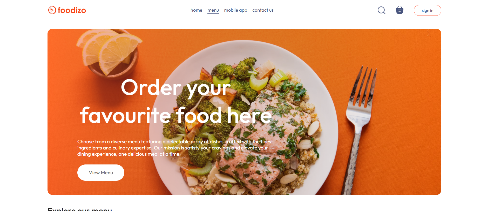

### 🏠 Homepage  
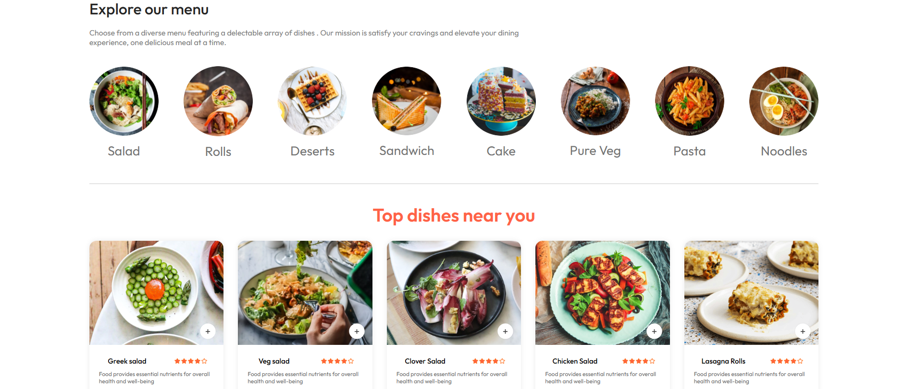

### 🏠 Homepage  
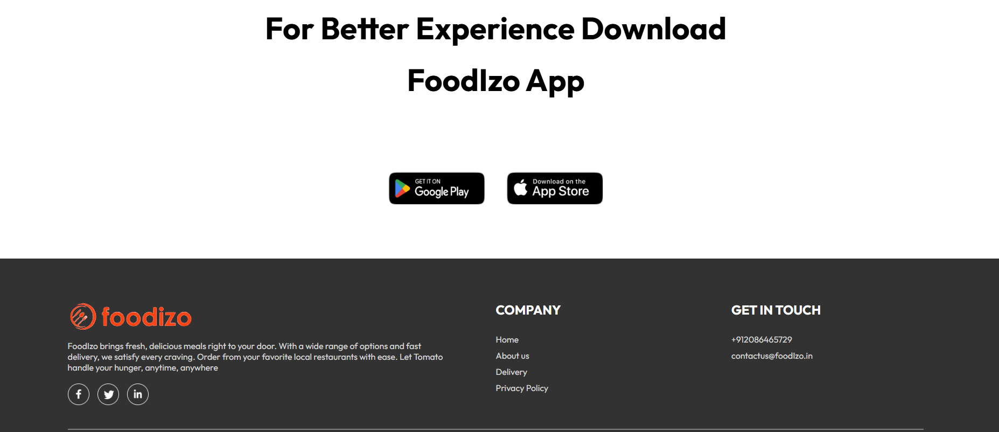

### 🔍 Filters & Search  
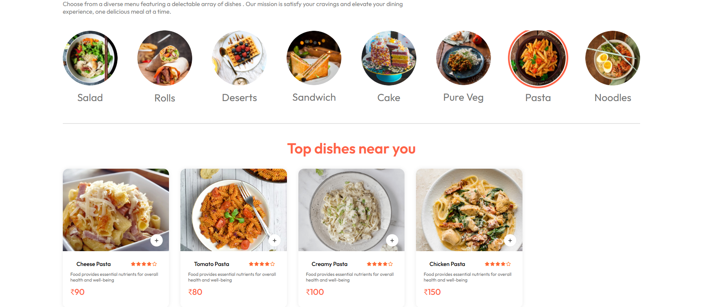

### 🛒 Cart & Checkout  
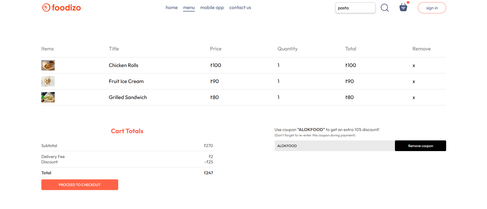
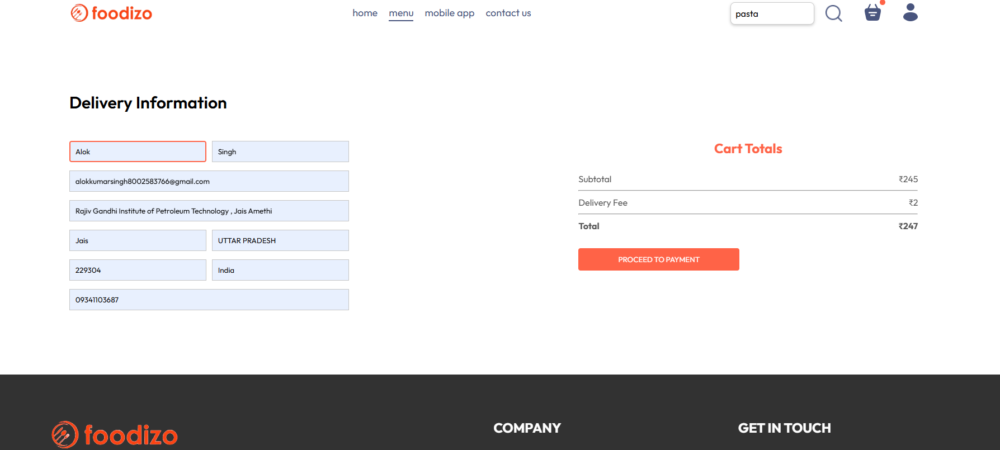

## 🔐 Login & Email Verification  
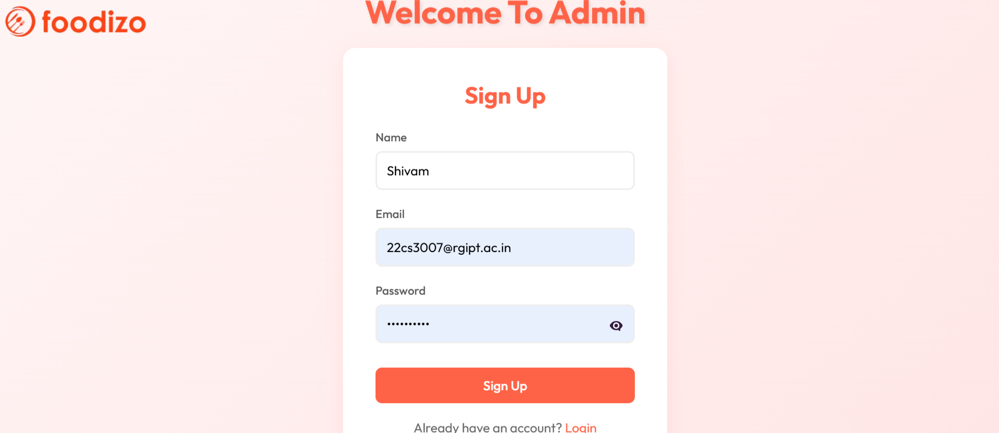

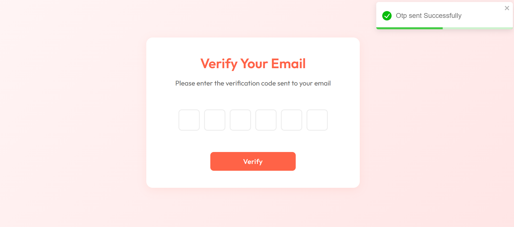

### 🧑‍💼 Admin Panel-Login
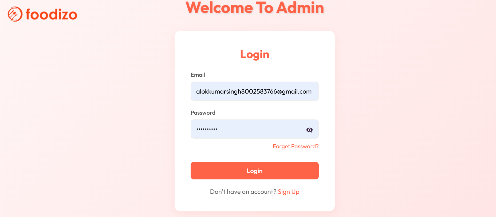
### 🧑‍💼 Admin Panel-Add Item
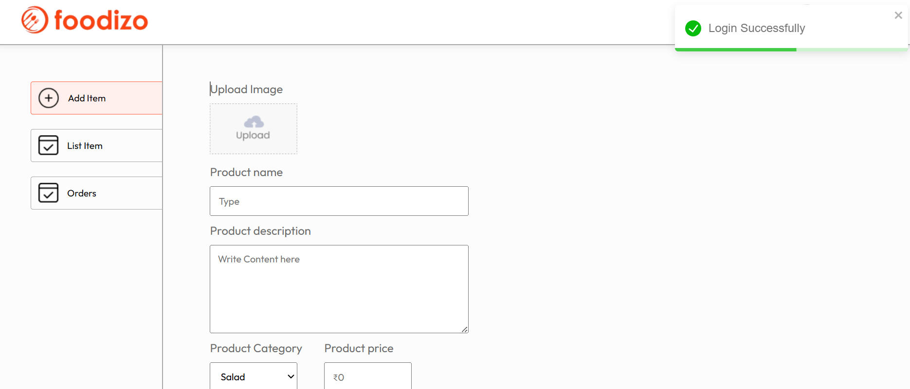
### 🧑‍💼 Admin Panel-List  
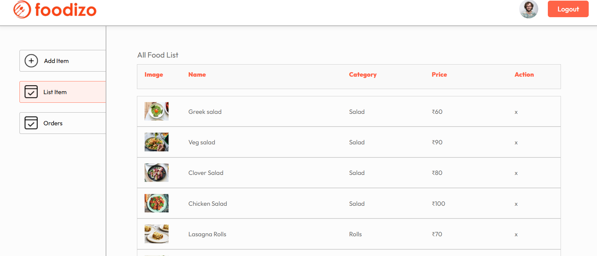
### 🧑‍💼 Admin Panel-All Order  
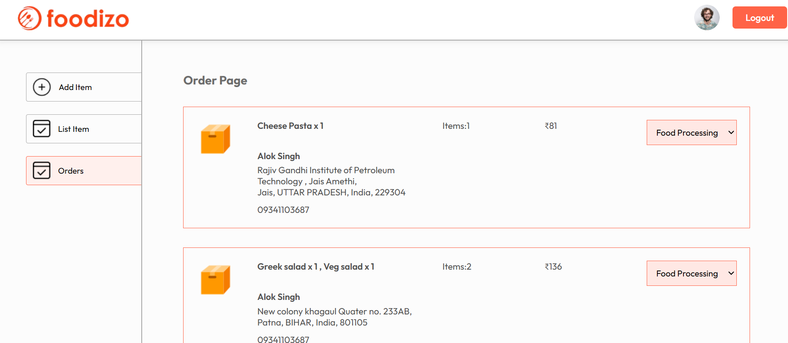

---

## ⚙️ Installation & Setup

### 1. Clone the Repository

```bash
git clone https://github.com/Alokkumar2228/foodizo.git
cd foodizo

